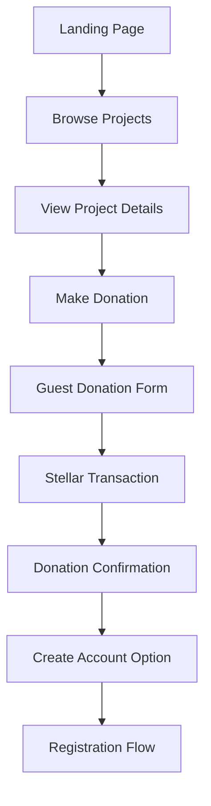
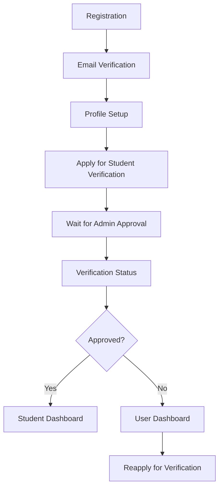
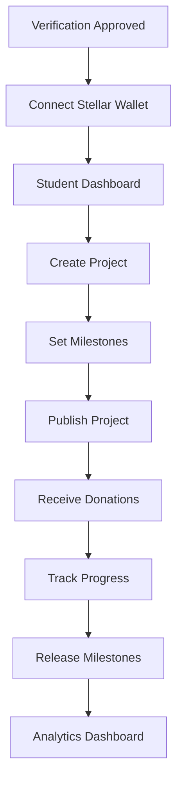
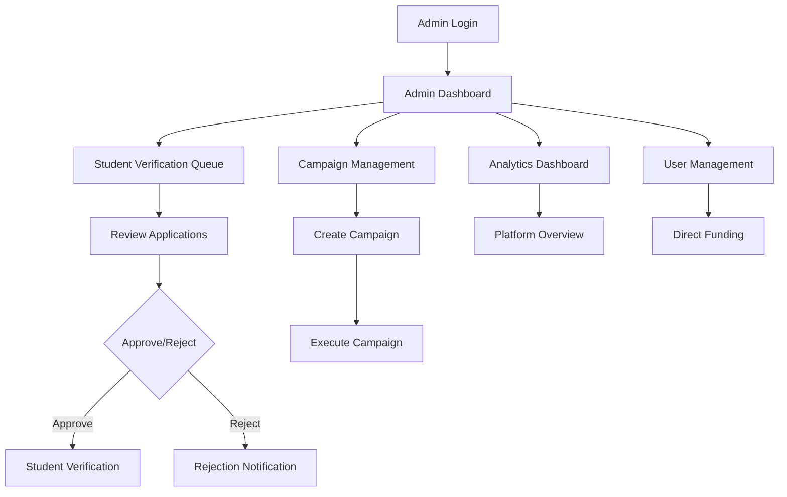
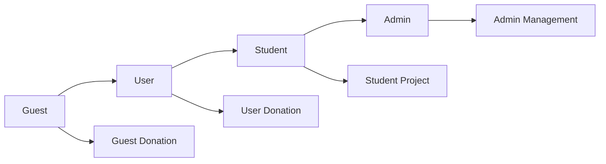

# FundHub User Lifecycle & Frontend Team Requirements

## 🎯 **COMPLETE USER LIFECYCLE DOCUMENTATION**

This guide provides comprehensive user lifecycle documentation, frontend team requirements, and implementation strategies for the FundHub crowdfunding platform.

## 👥 **USER ROLES & PERMISSIONS MATRIX**

### **Role Hierarchy**
```typescript
enum UserRole {
  GUEST = 'guest',           // Anonymous users
  USER = 'user',             // Registered users
  STUDENT = 'student',       // Verified students
  ADMIN = 'admin'            // Platform administrators
}

enum BaseRole {
  GUEST = 'guest',
  BASE_USER = 'base_user',
  STUDENT = 'student',
  ADMIN = 'admin'
}
```

### **Permission Matrix**
| Feature | Guest | User | Student | Admin |
|---------|-------|------|---------|-------|
| View Public Projects | ✅ | ✅ | ✅ | ✅ |
| Make Donations | ✅ | ✅ | ✅ | ✅ |
| Create Account | ❌ | ✅ | ✅ | ✅ |
| Apply for Student Verification | ❌ | ✅ | ❌ | ✅ |
| Connect Stellar Wallet | ❌ | ❌ | ✅ | ✅ |
| Create Projects | ❌ | ❌ | ✅ | ✅ |
| Manage Milestones | ❌ | ❌ | ✅ | ✅ |
| Receive Donations | ❌ | ❌ | ✅ | ✅ |
| Access Analytics | ❌ | ❌ | ✅ | ✅ |
| Admin Dashboard | ❌ | ❌ | ❌ | ✅ |
| Manage Verifications | ❌ | ❌ | ❌ | ✅ |
| Create Campaigns | ❌ | ❌ | ❌ | ✅ |
| Platform Oversight | ❌ | ❌ | ❌ | ✅ |

## 🚀 **COMPLETE USER JOURNEYS**

### **1. Guest User Journey**

#### **Entry Points**
- Landing page discovery
- Social media links
- Direct project URLs
- Search engine results

#### **Guest User Capabilities**
```typescript
// Guest can access:
const guestCapabilities = {
  viewPublicProjects: true,
  makeDonations: true,
  viewProjectDetails: true,
  browseCategories: true,
  searchProjects: true,
  viewProjectMedia: true,
  accessPublicAnalytics: false,
  createAccount: true
};
```

#### **Guest User Flow**


#### **Frontend Implementation**
```typescript
// Guest Landing Page
export const GuestLandingPage = () => {
  return (
    <div className="guest-landing">
      <HeroSection />
      <FeaturedProjects />
      <ProjectCategories />
      <CallToAction />
    </div>
  );
};

// Guest Donation Form
export const GuestDonationForm = ({ projectId }: { projectId: string }) => {
  const [guestInfo, setGuestInfo] = useState({
    name: '',
    email: '',
    amount: 0,
    txHash: ''
  });

  const handleDonation = async () => {
    try {
      await api.post('/guest/fund', {
        guest_name: guestInfo.name,
        guest_email: guestInfo.email,
        project_id: projectId,
        amount: guestInfo.amount,
        tx_hash: guestInfo.txHash
      });
      // Show success message
    } catch (error) {
      // Handle error
    }
  };

  return (
    <form onSubmit={handleDonation}>
      <input
        type="text"
        placeholder="Your Name"
        value={guestInfo.name}
        onChange={(e) => setGuestInfo({...guestInfo, name: e.target.value})}
      />
      <input
        type="email"
        placeholder="Your Email"
        value={guestInfo.email}
        onChange={(e) => setGuestInfo({...guestInfo, email: e.target.value})}
      />
      <input
        type="number"
        placeholder="Donation Amount"
        value={guestInfo.amount}
        onChange={(e) => setGuestInfo({...guestInfo, amount: Number(e.target.value)})}
      />
      <input
        type="text"
        placeholder="Transaction Hash"
        value={guestInfo.txHash}
        onChange={(e) => setGuestInfo({...guestInfo, txHash: e.target.value})}
      />
      <button type="submit">Donate</button>
    </form>
  );
};
```

### **2. Registered User Journey**

#### **Registration Process**
```typescript
// User Registration Flow
const userRegistrationFlow = {
  step1: 'Account Creation',
  step2: 'Email Verification',
  step3: 'Profile Setup',
  step4: 'Student Verification Application',
  step5: 'Wait for Admin Approval'
};
```

#### **Registered User Capabilities**
```typescript
const userCapabilities = {
  viewPublicProjects: true,
  makeDonations: true,
  createAccount: true,
  applyForStudentVerification: true,
  viewDonationHistory: true,
  updateProfile: true,
  accessBasicAnalytics: false,
  createProjects: false,
  receiveDonations: false
};
```

#### **Registered User Flow**


#### **Frontend Implementation**
```typescript
// User Registration Component
export const UserRegistration = () => {
  const [formData, setFormData] = useState({
    username: '',
    email: '',
    password: '',
    confirmPassword: ''
  });

  const handleRegistration = async () => {
    try {
      const response = await api.post('/auth/signup', formData);
      // Handle successful registration
      showSuccessMessage('Registration successful! Please check your email.');
    } catch (error) {
      // Handle registration error
      showErrorMessage('Registration failed. Please try again.');
    }
  };

  return (
    <form onSubmit={handleRegistration}>
      <input
        type="text"
        placeholder="Username"
        value={formData.username}
        onChange={(e) => setFormData({...formData, username: e.target.value})}
      />
      <input
        type="email"
        placeholder="Email"
        value={formData.email}
        onChange={(e) => setFormData({...formData, email: e.target.value})}
      />
      <input
        type="password"
        placeholder="Password"
        value={formData.password}
        onChange={(e) => setFormData({...formData, password: e.target.value})}
      />
      <input
        type="password"
        placeholder="Confirm Password"
        value={formData.confirmPassword}
        onChange={(e) => setFormData({...formData, confirmPassword: e.target.value})}
      />
      <button type="submit">Register</button>
    </form>
  );
};

// Student Verification Application
export const StudentVerificationApplication = () => {
  const [schoolEmail, setSchoolEmail] = useState('');
  const [verificationStatus, setVerificationStatus] = useState('pending');

  const applyForVerification = async () => {
    try {
      await api.post('/students/apply-verification', {
        school_email: schoolEmail
      });
      setVerificationStatus('pending');
      showSuccessMessage('Verification application submitted!');
    } catch (error) {
      showErrorMessage('Application failed. Please try again.');
    }
  };

  return (
    <div className="verification-application">
      <h2>Apply for Student Verification</h2>
      <input
        type="email"
        placeholder="School Email (e.g., john@university.edu)"
        value={schoolEmail}
        onChange={(e) => setSchoolEmail(e.target.value)}
      />
      <button onClick={applyForVerification}>
        Apply for Verification
      </button>
      <div className="status">
        Status: {verificationStatus}
      </div>
    </div>
  );
};
```

### **3. Verified Student Journey**

#### **Student Verification Process**
```typescript
// Student Verification Workflow
const studentVerificationWorkflow = {
  step1: 'Submit School Email',
  step2: 'Admin Review',
  step3: 'Admin Decision',
  step4: 'Verification Status Update',
  step5: 'Student Dashboard Access'
};
```

#### **Verified Student Capabilities**
```typescript
const studentCapabilities = {
  viewPublicProjects: true,
  makeDonations: true,
  createAccount: true,
  connectStellarWallet: true,
  createProjects: true,
  manageMilestones: true,
  receiveDonations: true,
  accessStudentAnalytics: true,
  updateProfile: true,
  viewDonationHistory: true
};
```

#### **Verified Student Flow**


#### **Frontend Implementation**
```typescript
// Student Dashboard
export const StudentDashboard = () => {
  const [projects, setProjects] = useState<Project[]>([]);
  const [wallet, setWallet] = useState<Wallet | null>(null);
  const [analytics, setAnalytics] = useState<StudentAnalytics | null>(null);

  useEffect(() => {
    const fetchDashboardData = async () => {
      try {
        const [projectsRes, walletRes, analyticsRes] = await Promise.all([
          api.get('/projects'),
          api.get('/wallets/balance/:wallet_id'),
          api.get('/analytics/students/:id')
        ]);
        
        setProjects(projectsRes.data);
        setWallet(walletRes.data);
        setAnalytics(analyticsRes.data);
      } catch (error) {
        console.error('Dashboard data fetch failed:', error);
      }
    };

    fetchDashboardData();
  }, []);

  return (
    <div className="student-dashboard">
      <div className="dashboard-header">
        <h1>Student Dashboard</h1>
        <WalletStatus wallet={wallet} />
      </div>
      
      <div className="dashboard-content">
        <div className="projects-section">
          <h2>My Projects</h2>
          <ProjectList projects={projects} />
          <CreateProjectButton />
        </div>
        
        <div className="analytics-section">
          <h2>Analytics</h2>
          <StudentAnalyticsChart data={analytics} />
        </div>
      </div>
    </div>
  );
};

// Project Creation Form
export const ProjectCreationForm = () => {
  const [projectData, setProjectData] = useState({
    title: '',
    description: '',
    repo_url: '',
    media_url: '',
    tags: [],
    funding_goal: 0
  });

  const handleSubmit = async () => {
    try {
      const response = await api.post('/projects', projectData);
      showSuccessMessage('Project created successfully!');
      // Redirect to project page
    } catch (error) {
      showErrorMessage('Project creation failed. Please try again.');
    }
  };

  return (
    <form onSubmit={handleSubmit}>
      <input
        type="text"
        placeholder="Project Title"
        value={projectData.title}
        onChange={(e) => setProjectData({...projectData, title: e.target.value})}
      />
      <textarea
        placeholder="Project Description"
        value={projectData.description}
        onChange={(e) => setProjectData({...projectData, description: e.target.value})}
      />
      <input
        type="url"
        placeholder="Repository URL"
        value={projectData.repo_url}
        onChange={(e) => setProjectData({...projectData, repo_url: e.target.value})}
      />
      <input
        type="url"
        placeholder="Media URL"
        value={projectData.media_url}
        onChange={(e) => setProjectData({...projectData, media_url: e.target.value})}
      />
      <input
        type="number"
        placeholder="Funding Goal (XLM)"
        value={projectData.funding_goal}
        onChange={(e) => setProjectData({...projectData, funding_goal: Number(e.target.value)})}
      />
      <button type="submit">Create Project</button>
    </form>
  );
};
```

### **4. Admin User Journey**

#### **Admin Capabilities**
```typescript
const adminCapabilities = {
  viewPublicProjects: true,
  makeDonations: true,
  createAccount: true,
  connectStellarWallet: true,
  createProjects: true,
  manageMilestones: true,
  receiveDonations: true,
  accessAllAnalytics: true,
  manageStudentVerifications: true,
  createCampaigns: true,
  executeCampaigns: true,
  platformOversight: true,
  accessAdminDashboard: true,
  manageAllUsers: true,
  viewActivityLogs: true,
  directFunding: true
};
```

#### **Admin Flow**


#### **Frontend Implementation**
```typescript
// Admin Dashboard
export const AdminDashboard = () => {
  const [pendingVerifications, setPendingVerifications] = useState<Verification[]>([]);
  const [campaigns, setCampaigns] = useState<Campaign[]>([]);
  const [platformStats, setPlatformStats] = useState<PlatformStats | null>(null);

  const approveVerification = async (verificationId: string) => {
    try {
      await api.post(`/admin/verifications/${verificationId}/approve`);
      showSuccessMessage('Verification approved!');
      // Refresh data
    } catch (error) {
      showErrorMessage('Approval failed. Please try again.');
    }
  };

  const rejectVerification = async (verificationId: string, reason: string) => {
    try {
      await api.post(`/admin/verifications/${verificationId}/reject`, { reason });
      showSuccessMessage('Verification rejected.');
      // Refresh data
    } catch (error) {
      showErrorMessage('Rejection failed. Please try again.');
    }
  };

  return (
    <div className="admin-dashboard">
      <div className="dashboard-header">
        <h1>Admin Dashboard</h1>
        <PlatformStats stats={platformStats} />
      </div>
      
      <div className="dashboard-content">
        <div className="verification-queue">
          <h2>Pending Verifications</h2>
          {pendingVerifications.map(verification => (
            <VerificationCard
              key={verification.id}
              verification={verification}
              onApprove={() => approveVerification(verification.id)}
              onReject={(reason) => rejectVerification(verification.id, reason)}
            />
          ))}
        </div>
        
        <div className="campaign-management">
          <h2>Campaign Management</h2>
          <CampaignList campaigns={campaigns} />
          <CreateCampaignButton />
        </div>
      </div>
    </div>
  );
};

// Campaign Creation Form
export const CampaignCreationForm = () => {
  const [campaignData, setCampaignData] = useState({
    name: '',
    description: '',
    criteria: '',
    reward_pool_xlm: 0
  });

  const handleSubmit = async () => {
    try {
      const response = await api.post('/campaigns/create', campaignData);
      showSuccessMessage('Campaign created successfully!');
    } catch (error) {
      showErrorMessage('Campaign creation failed. Please try again.');
    }
  };

  return (
    <form onSubmit={handleSubmit}>
      <input
        type="text"
        placeholder="Campaign Name"
        value={campaignData.name}
        onChange={(e) => setCampaignData({...campaignData, name: e.target.value})}
      />
      <textarea
        placeholder="Campaign Description"
        value={campaignData.description}
        onChange={(e) => setCampaignData({...campaignData, description: e.target.value})}
      />
      <select
        value={campaignData.criteria}
        onChange={(e) => setCampaignData({...campaignData, criteria: e.target.value})}
      >
        <option value="">Select Criteria</option>
        <option value="verified_students">Verified Students</option>
        <option value="active_projects">Students with Active Projects</option>
        <option value="recent_donations">Students with Recent Donations</option>
      </select>
      <input
        type="number"
        placeholder="Reward Pool (XLM)"
        value={campaignData.reward_pool_xlm}
        onChange={(e) => setCampaignData({...campaignData, reward_pool_xlm: Number(e.target.value)})}
      />
      <button type="submit">Create Campaign</button>
    </form>
  );
};
```

## 🔄 **USER STATE TRANSITIONS**

### **State Transition Matrix**
```typescript
// User State Transitions
const userStateTransitions = {
  guest: {
    canBecome: ['user'],
    requirements: ['registration']
  },
  user: {
    canBecome: ['student'],
    requirements: ['student_verification']
  },
  student: {
    canBecome: ['admin'],
    requirements: ['admin_promotion']
  },
  admin: {
    canBecome: [],
    requirements: []
  }
};
```

### **State Transition Flow**


## 📱 **MOBILE-FIRST DESIGN REQUIREMENTS**

### **Responsive Breakpoints**
```typescript
const breakpoints = {
  mobile: '320px',
  tablet: '768px',
  desktop: '1024px',
  wide: '1280px'
};

// Mobile-first CSS approach
const responsiveDesign = {
  mobile: {
    navigation: 'hamburger_menu',
    layout: 'single_column',
    forms: 'stacked',
    tables: 'horizontal_scroll'
  },
  tablet: {
    navigation: 'sidebar',
    layout: 'two_column',
    forms: 'grouped',
    tables: 'responsive'
  },
  desktop: {
    navigation: 'full_sidebar',
    layout: 'multi_column',
    forms: 'inline',
    tables: 'full_width'
  }
};
```

### **Mobile Navigation**
```typescript
// Mobile Navigation Component
export const MobileNavigation = () => {
  const [isOpen, setIsOpen] = useState(false);
  const { user } = useAuth();

  return (
    <div className="mobile-navigation">
      <button
        onClick={() => setIsOpen(!isOpen)}
        className="hamburger-button"
      >
        <MenuIcon className="h-6 w-6" />
      </button>
      
      {isOpen && (
        <div className="mobile-menu">
          <NavigationMenu user={user} />
          <UserProfile user={user} />
        </div>
      )}
    </div>
  );
};
```

## 🎨 **UI/UX REQUIREMENTS**

### **Design System**
```typescript
// Design Tokens
const designTokens = {
  colors: {
    primary: '#3B82F6',
    secondary: '#10B981',
    accent: '#F59E0B',
    danger: '#EF4444',
    success: '#10B981',
    warning: '#F59E0B',
    info: '#3B82F6',
    neutral: {
      50: '#F9FAFB',
      100: '#F3F4F6',
      200: '#E5E7EB',
      300: '#D1D5DB',
      400: '#9CA3AF',
      500: '#6B7280',
      600: '#4B5563',
      700: '#374151',
      800: '#1F2937',
      900: '#111827'
    }
  },
  typography: {
    fontFamily: 'Inter, sans-serif',
    sizes: {
      xs: '0.75rem',
      sm: '0.875rem',
      base: '1rem',
      lg: '1.125rem',
      xl: '1.25rem',
      '2xl': '1.5rem',
      '3xl': '1.875rem',
      '4xl': '2.25rem'
    },
    weights: {
      normal: 400,
      medium: 500,
      semibold: 600,
      bold: 700
    }
  },
  spacing: {
    xs: '0.25rem',
    sm: '0.5rem',
    md: '1rem',
    lg: '1.5rem',
    xl: '2rem',
    '2xl': '3rem'
  },
  borderRadius: {
    sm: '0.25rem',
    md: '0.5rem',
    lg: '0.75rem',
    xl: '1rem'
  },
  shadows: {
    sm: '0 1px 2px 0 rgba(0, 0, 0, 0.05)',
    md: '0 4px 6px -1px rgba(0, 0, 0, 0.1)',
    lg: '0 10px 15px -3px rgba(0, 0, 0, 0.1)',
    xl: '0 20px 25px -5px rgba(0, 0, 0, 0.1)'
  }
};
```

### **Component Library Requirements**
```typescript
// Required Components
const componentLibrary = {
  // Layout Components
  layout: [
    'Header',
    'Footer',
    'Sidebar',
    'Navigation',
    'Breadcrumbs',
    'Container',
    'Grid',
    'Stack'
  ],
  
  // Form Components
  forms: [
    'Input',
    'Textarea',
    'Select',
    'Checkbox',
    'Radio',
    'Button',
    'FormGroup',
    'FormLabel',
    'FormError'
  ],
  
  // Data Display
  data: [
    'Table',
    'Card',
    'List',
    'Badge',
    'Avatar',
    'Progress',
    'Chart',
    'Stat'
  ],
  
  // Feedback
  feedback: [
    'Alert',
    'Toast',
    'Modal',
    'Dialog',
    'Tooltip',
    'Popover',
    'Loading',
    'Skeleton'
  ],
  
  // Navigation
  navigation: [
    'Menu',
    'Tabs',
    'Pagination',
    'Breadcrumb',
    'Stepper',
    'Tabs'
  ]
};
```

## 🔒 **SECURITY REQUIREMENTS**

### **Authentication Security**
```typescript
// Security Implementation
const securityRequirements = {
  authentication: {
    jwtTokens: true,
    refreshTokens: true,
    tokenExpiration: '15m',
    refreshExpiration: '7d',
    passwordHashing: 'Argon2',
    emailVerification: true,
    twoFactorAuth: false // Future enhancement
  },
  
  authorization: {
    roleBasedAccess: true,
    resourceBasedPermissions: true,
    middlewareProtection: true,
    routeGuards: true
  },
  
  dataProtection: {
    inputValidation: true,
    outputSanitization: true,
    sqlInjectionPrevention: true,
    xssProtection: true,
    csrfProtection: true
  },
  
  blockchain: {
    transactionVerification: true,
    walletValidation: true,
    multiSignatureSupport: false // Future enhancement
  }
};
```

### **Frontend Security Implementation**
```typescript
// Security Hooks
export const useSecurity = () => {
  const [isAuthenticated, setIsAuthenticated] = useState(false);
  const [userRole, setUserRole] = useState<UserRole | null>(null);
  
  const checkAuth = async () => {
    try {
      const token = localStorage.getItem('access_token');
      if (!token) {
        setIsAuthenticated(false);
        return;
      }
      
      const response = await api.get('/auth/profile');
      setIsAuthenticated(true);
      setUserRole(response.data.role);
    } catch (error) {
      setIsAuthenticated(false);
      setUserRole(null);
      localStorage.removeItem('access_token');
      localStorage.removeItem('refresh_token');
    }
  };
  
  const requireAuth = (requiredRole?: UserRole) => {
    if (!isAuthenticated) {
      throw new Error('Authentication required');
    }
    
    if (requiredRole && userRole !== requiredRole) {
      throw new Error('Insufficient permissions');
    }
  };
  
  return { isAuthenticated, userRole, checkAuth, requireAuth };
};
```

## 📊 **ANALYTICS & TRACKING REQUIREMENTS**

### **Analytics Implementation**
```typescript
// Analytics Tracking
export const useAnalytics = () => {
  const trackEvent = (event: string, properties: Record<string, any>) => {
    // Track user events
    analytics.track(event, properties);
  };
  
  const trackPageView = (page: string) => {
    analytics.page(page);
  };
  
  const trackUserAction = (action: string, context: Record<string, any>) => {
    analytics.track(action, {
      ...context,
      timestamp: new Date().toISOString(),
      userAgent: navigator.userAgent
    });
  };
  
  return { trackEvent, trackPageView, trackUserAction };
};
```

### **Performance Monitoring**
```typescript
// Performance Monitoring
export const usePerformanceMonitoring = () => {
  const [metrics, setMetrics] = useState<PerformanceMetrics | null>(null);
  
  useEffect(() => {
    const observer = new PerformanceObserver((list) => {
      const entries = list.getEntries();
      const newMetrics = calculateMetrics(entries);
      setMetrics(newMetrics);
    });
    
    observer.observe({ entryTypes: ['navigation', 'paint', 'largest-contentful-paint'] });
    
    return () => observer.disconnect();
  }, []);
  
  return metrics;
};
```

## 🚀 **DEPLOYMENT REQUIREMENTS**

### **Environment Configuration**
```typescript
// Environment Variables
const environmentConfig = {
  development: {
    API_URL: 'http://localhost:3000/api',
    STELLAR_NETWORK: 'testnet',
    HORIZON_URL: 'https://horizon-testnet.stellar.org',
    DEBUG: true
  },
  staging: {
    API_URL: 'https://staging-api.fundhub.com/api',
    STELLAR_NETWORK: 'testnet',
    HORIZON_URL: 'https://horizon-testnet.stellar.org',
    DEBUG: true
  },
  production: {
    API_URL: 'https://api.fundhub.com/api',
    STELLAR_NETWORK: 'public',
    HORIZON_URL: 'https://horizon.stellar.org',
    DEBUG: false
  }
};
```

### **Build Configuration**
```typescript
// Next.js Configuration
const nextConfig = {
  env: {
    NEXT_PUBLIC_API_URL: process.env.NEXT_PUBLIC_API_URL,
    NEXT_PUBLIC_STELLAR_NETWORK: process.env.NEXT_PUBLIC_STELLAR_NETWORK,
    NEXT_PUBLIC_HORIZON_URL: process.env.NEXT_PUBLIC_HORIZON_URL
  },
  images: {
    domains: ['example.com', 'github.com', 'stellar.org']
  },
  experimental: {
    appDir: true,
    serverComponents: true
  },
  webpack: (config) => {
    config.resolve.fallback = {
      ...config.resolve.fallback,
      fs: false,
      net: false,
      tls: false
    };
    return config;
  }
};
```

## 🧪 **TESTING REQUIREMENTS**

### **Testing Strategy**
```typescript
// Testing Requirements
const testingRequirements = {
  unitTests: {
    coverage: '80%',
    frameworks: ['Jest', 'React Testing Library'],
    components: 'All components',
    hooks: 'All custom hooks',
    utilities: 'All utility functions'
  },
  
  integrationTests: {
    apiIntegration: 'All API endpoints',
    userFlows: 'Complete user journeys',
    authentication: 'Auth flows',
    blockchain: 'Stellar integration'
  },
  
  e2eTests: {
    userJourneys: 'All user roles',
    criticalPaths: 'Donation flow, project creation',
    crossBrowser: 'Chrome, Firefox, Safari, Edge',
    mobile: 'iOS, Android'
  },
  
  performanceTests: {
    loadTesting: 'Concurrent users',
    stressTesting: 'Peak load scenarios',
    mobilePerformance: 'Mobile device testing'
  }
};
```

### **Test Implementation**
```typescript
// Example Test Suite
describe('User Authentication', () => {
  it('should allow user registration', async () => {
    const { getByLabelText, getByText } = render(<RegistrationForm />);
    
    fireEvent.change(getByLabelText('Username'), { target: { value: 'testuser' } });
    fireEvent.change(getByLabelText('Email'), { target: { value: 'test@example.com' } });
    fireEvent.change(getByLabelText('Password'), { target: { value: 'password123' } });
    
    fireEvent.click(getByText('Register'));
    
    await waitFor(() => {
      expect(getByText('Registration successful!')).toBeInTheDocument();
    });
  });
});
```

## 📋 **COMPLETE IMPLEMENTATION CHECKLIST**

### **Phase 1: Foundation (Weeks 1-2)**
- [ ] Project setup and configuration
- [ ] Design system implementation
- [ ] Component library creation
- [ ] Authentication system
- [ ] Basic routing and navigation
- [ ] Responsive design framework

### **Phase 2: Core Features (Weeks 3-4)**
- [ ] User registration and login
- [ ] Student verification workflow
- [ ] Project management system
- [ ] Basic donation functionality
- [ ] User dashboard implementation

### **Phase 3: Blockchain Integration (Weeks 5-6)**
- [ ] Stellar wallet connection
- [ ] Transaction processing
- [ ] Donation verification
- [ ] Wallet balance display
- [ ] Transaction history

### **Phase 4: Advanced Features (Weeks 7-8)**
- [ ] Analytics dashboard
- [ ] Real-time notifications
- [ ] Admin dashboard
- [ ] Campaign management
- [ ] Milestone system

### **Phase 5: Optimization (Weeks 9-10)**
- [ ] Performance optimization
- [ ] Mobile optimization
- [ ] Security hardening
- [ ] Testing implementation
- [ ] Documentation completion

### **Phase 6: Deployment (Weeks 11-12)**
- [ ] Production deployment
- [ ] Monitoring setup
- [ ] Error tracking
- [ ] Performance monitoring
- [ ] User feedback collection

## 🎯 **SUCCESS METRICS**

### **User Experience Metrics**
- **User Registration Rate**: Target 70% of visitors
- **Student Verification Rate**: Target 80% approval rate
- **Project Creation Rate**: Target 50% of verified students
- **Donation Success Rate**: Target 95% transaction success
- **User Retention**: Target 60% monthly retention

### **Technical Metrics**
- **Page Load Time**: Target < 2 seconds
- **API Response Time**: Target < 500ms
- **Mobile Performance**: Target 90+ Lighthouse score
- **Uptime**: Target 99.9% availability
- **Error Rate**: Target < 1% error rate

### **Business Metrics**
- **Total Donations**: Track monthly donation volume
- **Project Success Rate**: Track funding completion
- **User Engagement**: Track daily/monthly active users
- **Platform Growth**: Track user and project growth
- **Revenue Metrics**: Track platform performance

This comprehensive guide provides everything needed to implement a complete, polished frontend for the FundHub platform, with detailed user lifecycles, technical requirements, and implementation strategies.
